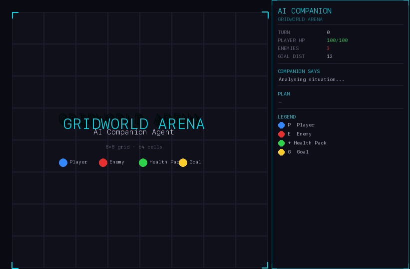

# AI Game Companion Agent

An AI companion that **sees** a tactical grid board through a vision model (BLIP-2) and **decides** what to do through a language model (Mistral-7B) — move, attack, heal, or cooperate with the player.



---

## What it does

Each turn the agent runs a full perception → reasoning → action loop:

1. **BLIP-2** takes a screenshot of the board and describes what it sees
2. **Mistral-7B** reads that description and outputs a JSON action with a 3-step plan, risk level, and a message for the player
3. The action is validated against a strict schema and executed — with BFS pathfinding and heuristic fallback if the model output is malformed

The companion also tracks its own HP trend and adapts its persona (cautious / aggressive / balanced) across turns.

## Architecture

```
Game Engine → VLM (BLIP-2) → LLM (Mistral-7B) → Action Parser → Game Engine
                                      ↑
                          Memory · Strategy · Player Intent
```

Everything is modular — you can swap BLIP-2 for any VLM, Mistral for any instruction-tuned LLM, or run the whole thing offline with the rule-based fallback (no GPU needed).

## Quick start

**No GPU? Use the offline demo:**
```bash
pip install pillow
python scripts/run_demo_offline.py
```

**With GPU (~16GB VRAM):**
```bash
pip install -r requirements.txt
python scripts/run_game.py --turns 20 --verbose
```

**Set player intent:**
```bash
python scripts/run_game.py --offline --intent "aggressive"   # fight more
python scripts/run_game.py --offline --intent "cautious"     # survive first
python scripts/run_game.py --offline --intent "rush goal"    # sprint to objective
```

## Tests

```bash
python3 -m pytest tests/
```

36 tests covering engine, schema validation, reasoning, memory, cooperation, and reproducibility. 100% schema compliance across 4682 automated turns.

## Stack

- Python 3.9+
- PyTorch + HuggingFace Transformers (BLIP-2, Mistral-7B)
- Pillow (rendering)
- No external APIs required
